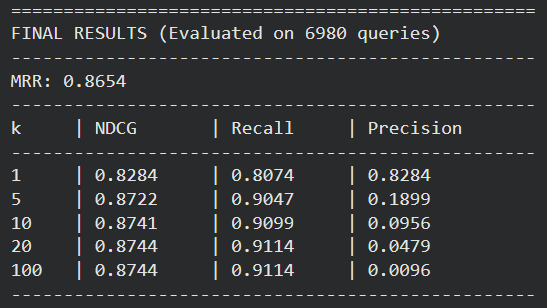
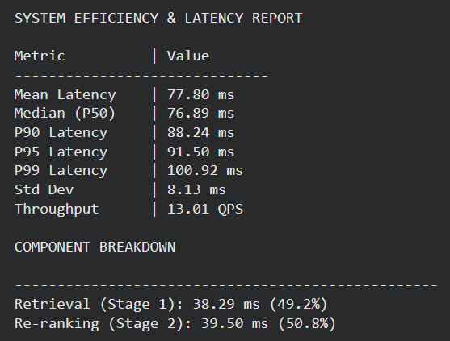
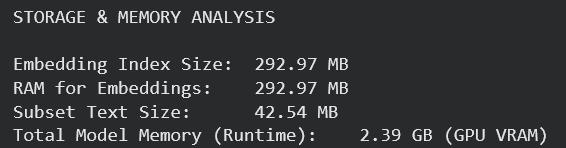

## MS MARCO Neural Semantic Search System

This project implements a high-performance, two-stage semantic search engine using the MS MARCO dataset. The system leverages a Bi-Encoder for fast initial retrieval and a Cross-Encoder for high-precision re-ranking, supplemented by Pseudo-Relevance Feedback (PRF) for query expansion.

# System Architecture

Stage 0: Query Expansion (Pseudo-Relevance Feedback)

  The initial user query is used to perform a "pilot" search against the FAISS index.
  The system extracts terms from the top k=3 retrieved passages to expand the original query, helping to mitigate vocabulary mismatch.

Stage 1: Fast Dense Retrieval (Bi-Encoder)
  Model: msmarco-distilbert-base-v4.
  Indexing: Uses FAISS (IndexFlatIP) for efficient similarity search.
  Operation: The expanded query is encoded into a 768-dimensional vector and compared against 100,000 indexed document embeddings using normalized cosine similarity.

Stage 2: High-Precision Re-ranking (Cross-Encoder)
  Model: ms-marco-MiniLM-L-6-v2.
  Optimization: Implements FP16 (Half-Precision) to double inference speed.
  Operation: The top 40 candidates from Stage 1 are re-scored by the Cross-Encoder to provide the final ranked results.

# Results and Benchmarks of neural search system:

  Based on an analysis of 100 test queries, the system demonstrates the following performance metrics:

